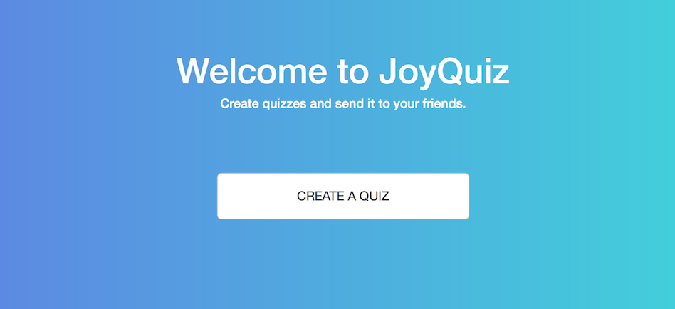
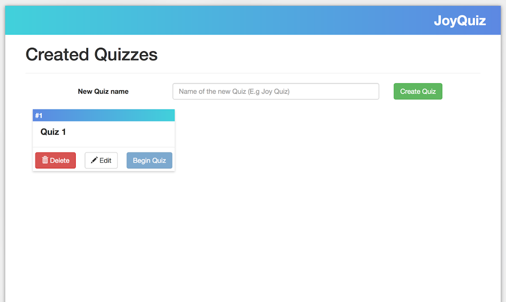
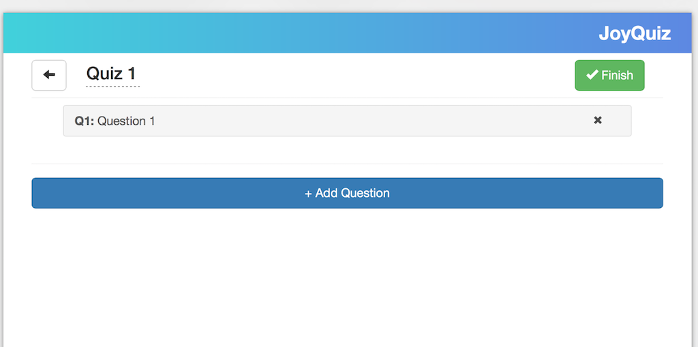
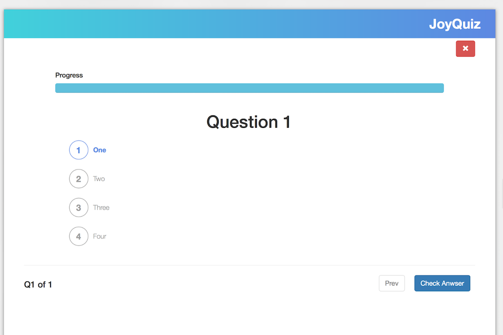
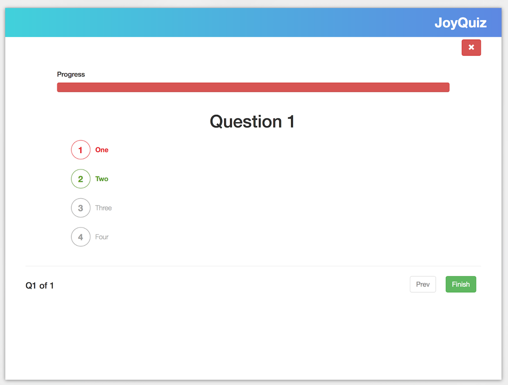
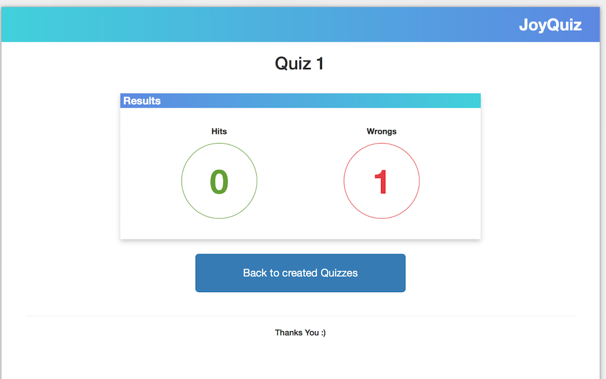

# JoyQuiz

Quiz application with React, Redux and other tools.



> ### React + Redux codebase containing JoyQuiz

## What is this?

This application built with React, Redux and other tools to create quizzes with questions and answers. Once the user has created a quiz, he can answer or other people.

## Libraries and tools

* Babel
* Bootstrap
* Eslint
* Localstorage
* React
* React Router
* Redux
* Prop Types

**General functionality:**

- Create Quizzes
- Create several questions and answers;
- Answer a questions;
- Show choice is correct or not;

## Requirements

For development, you will only need Node.js installed on your environement.
And please use the appropriate [Editorconfig](http://editorconfig.org/) plugin for your Editor (not mandatory).

### Node

[Node](http://nodejs.org/) is really easy to install & now include [NPM](https://npmjs.org/).
You should be able to run the following command after the installation procedure
below.

    $ node --version
    v8.9.4

    $ npm --version
    5.6.0

#### Node installation on OS X

You will need to use a Terminal. On OS X, you can find the default terminal in
`/Applications/Utilities/Terminal.app`.

Please install [Homebrew](http://brew.sh/) if it's not already done with the following command.

    $ ruby -e "$(curl -fsSL https://raw.github.com/Homebrew/homebrew/go/install)"

If everything when fine, you should run

    brew install node

#### Node installation on Linux

    sudo apt-get install python-software-properties
    sudo add-apt-repository ppa:chris-lea/node.js
    sudo apt-get update
    sudo apt-get install nodejs

#### Node installation on Windows

Just go on [official Node.js website](http://nodejs.org/) & grab the installer.
Also, be sure to have `git` available in your PATH, `npm` might need it.

---

## Getting started

### Install

To get the frontend running locally:

- Clone this repo
- `npm install` to install all req'd dependencies
- `npm start` to start the local server (this project uses create-react-app)

Runs the app in the development mode.
Open [http://localhost:3000](http://localhost:3000) to view it in the browser.

## Functionality overview


## Folder Structure

After creation, your project should look like this:

```
joyquiz/
  README.md
  node_modules/
  package.json
  public/
    index.html
    favicon.ico
    manifest.json
  src/
    components/
      addQuiz/
      card/
      emptyinfo/
      listQuestions/
      listQuiz/
      modalquestion/
      navbar/
      quiz/
      scorequiz/
    pages/
      beginquiz/
      dashboard/
      edit/
      welcome/
    reducers/
      index.js
      quiz.js
    index.css
    index.js
    router.js
```

## Screenshots
Functionality overview

### Created Quizzes



### Add Questions and Answers



### Answer a questions



### Show choice is correct or not;



### Show results;




